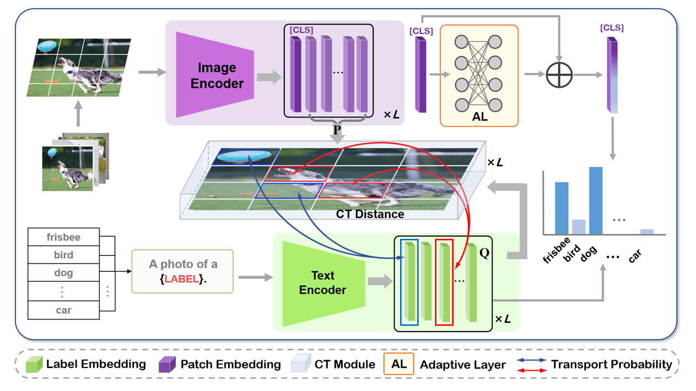

# PatchCT: Aligning Patch Set and Label Set with Conditional Transport for Multi-Label Image Classification

Multi-label image classification is a prediction task that aims to identify more than one label from a given image.This paper considers the semantic consistency of the latent space between the visual patch and linguistic label domains and introduces the conditional transport (CT) theory to bridge the acknowledged gap. While recent cross-modal attention-based studies have attempted to align such two representations and achieved impressive performance, they required carefully-designed alignment modules and extra complex operations in the attention computation. We find that by formulating the multi-label classification as a CT problem, we can exploit the interactions between the image and label efficiently by minimizing the bidirectional CT cost. Specifically, after feeding the images and textual labels into the modality-specific encoders, we view each image as a mixture of patch embeddings and a mixture of label embeddings, which capture the local region features and the class prototypes, respectively. CT is then employed to learn and align those two semantic sets by defining the forward and backward navigators. Importantly, the defined navigators in CT distance models the similarities between patches and labels, which provides an interpretable tool to visualize the learned prototypes. Extensive experiments on three public image benchmarks show that the proposed model consistently outperforms the previous methods.
